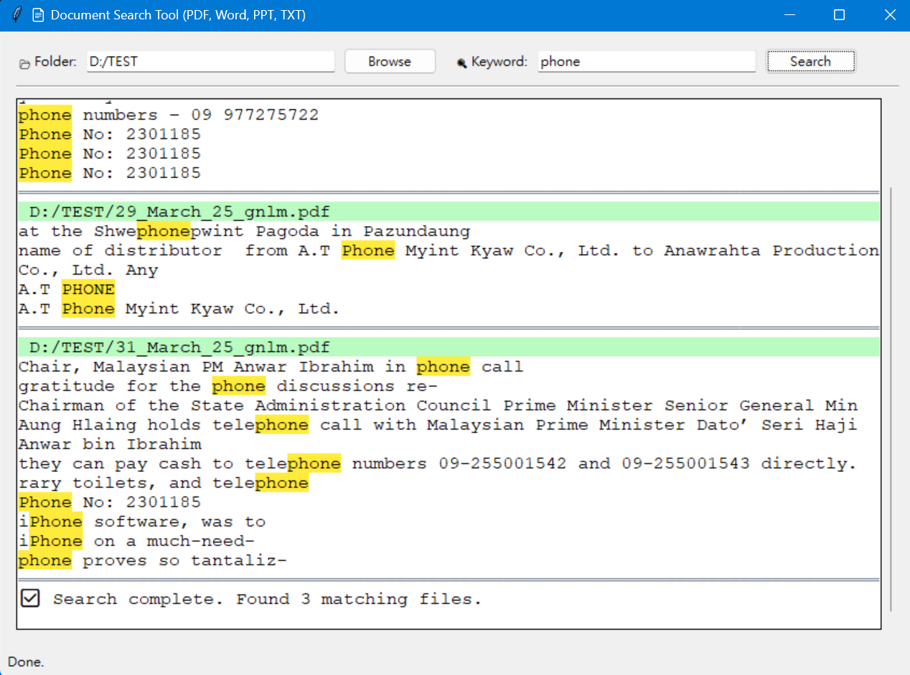

# 📄 Document Keyword Searcher (PDF, Word, PPT, TXT)

A fast and user-friendly document search tool for Windows.  

Supports keyword search inside PDF, Word (`.docx`), PowerPoint (`.pptx`), and plain text files in a selected folder (including subfolders). Results are styled with clean highlights and organized view.



---

## ✨ Features

- 🔍 **Search multiple file types**: `.pdf`, `.docx`, `.pptx`, `.txt`
- 🧠 **Multithreaded** search for fast performance
- 📂 **Recursive folder scanning** for deep file structures
- 🎯 **Case-insensitive** keyword matching
- 💡 **Highlight** all matches with styled results
- 🎨 Clean and intuitive UI built with `tkinter`
- ❌ **Cancelable** search in progress

---

## 🔧 Installation

### 1. Install dependencies

Use `pip` to install required Python packages:

```bash
pip install -r requirements.txt
```

### 2. (Optional) Local library support
If you have custom or local Python libraries (e.g., a patched version of `fitz`),
place them under the `libs/` folder. The app will automatically add `libs/` to `sys.path`.

```
doc-keyword-searcher/
├── libs/
│   └── your_custom_lib/
├── search_gui.py
```
No additional configuration is needed.

### 3. Run the application
```bash
python search_gui.py
```

### 4. License
MIT License © 2025 junr0ng
